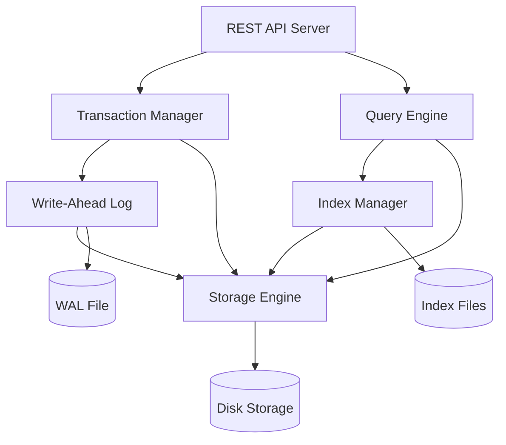

# Design Document: Monster Backend Database

## Overview

The Monster Backend Database is a production-grade embedded database engine written in Go, designed for high-performance concurrent operations with ACID-like guarantees. The system evolves through 10 phases, building from a basic thread-safe storage engine to a fully-featured database with REST API, comprehensive benchmarking, and production deployment capabilities.

The architecture prioritizes:
- **Concurrency Safety**: All operations are thread-safe with proper mutex protection and atomic writes
- **Performance**: O(1) indexed lookups, efficient query execution, and optimized storage patterns
- **Durability**: Write-ahead logging ensures no committed data is lost
- **Modularity**: Clean separation of concerns with decoupled, testable components
- **Production Readiness**: Comprehensive testing, benchmarking, and deployment automation

## Architecture

### High-Level Component Diagram



### Module Structure

```
/monster-backend-database
├── /core              # Core types and interfaces
├── /storage           # Storage engine with file operations
├── /index             # Primary and secondary index management
├── /query             # Query engine with filtering and sorting
├── /transaction       # Transaction manager with ACID support
├── /wal               # Write-ahead log for crash recovery
├── /api               # REST API server with auth and rate limiting
├── /benchmark         # Performance benchmarking suite
├── /loadtest          # Concurrent load testing
├── /docker            # Docker and docker-compose configuration
└── /tests             # Integration and end-to-end tests
```

### Data Flow

**Write Path:**
1. Client sends write request to API Server
2. Transaction Manager buffers operation in memory
3. On commit, WAL System logs operation to disk with fsync
4. Storage Engine performs atomic write to collection file
5. Index Manager updates all relevant indexes
6. Success response returned to client

**Read Path:**
1. Client sends query to API Server
2. Query Engine analyzes filters and selects optimal index
3. Index Manager performs O(1) lookup or range scan
4. Storage Engine retrieves documents from disk
5. Query Engine applies additional filters, sorting, and pagination
6. Results returned to client

**Recovery Path:**
1. Database starts and detects uncommitted WAL entries
2. WAL System replays operations in sequence order
3. Storage Engine and Index Manager apply operations
4. WAL truncated after successful replay
5. Database ready for normal operations

## Components and Interfaces

### Core Types

```go
// Document represents a JSON document stored in the database
type Document map[string]interface{}

// DocumentID is the unique identifier for a document
type DocumentID string

// Collection represents a logical grouping of documents
type Collection struct {
    Name    string
    Storage *StorageEngine
    Indexes *IndexManager
}

// Query represents a database query with filters and options
type Query struct {
    Collection string
    Filters    []Filter
    Sort       *SortOption
    Limit      int
    Offset     int
}

// Filter represents a query filter condition
type Filter struct {
    Field    string
    Operator FilterOperator
    Value    interface{}
}

// FilterOperator defines comparison operators
type FilterOperator int

const (
    OpEqual FilterOperator = iota
    OpGreaterThan
    OpLessThan
    OpGreaterThanOrEqual
    OpLessThanOrEqual
)

// Transaction represents an ACID transaction
type Transaction struct {
    ID         string
    Operations []Operation
    Committed  bool
}

// Operation represents a single database operation
type Operation struct {
    Type       OperationType
    Collection string
    DocID      DocumentID
    Document   Document
}

// OperationType defines operation types
type OperationType int

const (
    OpInsert OperationType = iota
    OpUpdate
    OpDelete
)
```

### Storage Engine Interface

```go
type StorageEngine interface {
    // WriteDocument atomically writes a document to storage
    WriteDocument(collection string, docID DocumentID, doc Document) error
    
    // ReadDocument retrieves a document by ID
    ReadDocument(collection string, docID DocumentID) (Document, error)
    
    // DeleteDocument removes a document from storage
    DeleteDocument(collection string, docID DocumentID) error
    
    // ScanCollection iterates over all documents in a collection
    ScanCollection(collection string, fn func(DocumentID, Document) bool) error
    
    // CreateCollection initializes a new collection
    CreateCollection(name string) error
    
    // ListCollections returns all collection names
    ListCollections() ([]string, error)
    
    // Close flushes pending writes and releases locks
    Close() error
}
```

**Implementation Details:**
- Use `sync.RWMutex` for read-write locking (multiple readers, single writer)
- Atomic writes via temp file + rename pattern
- File locking using `syscall.Flock` on Unix systems
- Each collection stored in separate JSON file: `{collection}.json`
- In-memory cache with LRU eviction for frequently accessed documents

### Index Manager Interface

```go
type IndexManager interface {
    // CreatePrimaryIndex builds the primary key index
    CreatePrimaryIndex(collection string) error
    
    // CreateSecondaryIndex builds an index on a field
    CreateSecondaryIndex(collection string, field string) error
    
    // LookupPrimary performs O(1) lookup by primary key
    LookupPrimary(collection string, docID DocumentID) (Document, error)
    
    // LookupSecondary finds documents matching a field value
    LookupSecondary(collection string, field string, value interface{}) ([]Document, error)
    
    // UpdateIndexes updates all indexes after a write operation
    UpdateIndexes(collection string, docID DocumentID, doc Document, op OperationType) error
    
    // PersistIndexes writes indexes to disk
    PersistIndexes(collection string) error
    
    // LoadIndexes reads indexes from disk
    LoadIndexes(collection string) error
    
    // RebuildIndexes reconstructs indexes from storage
    RebuildIndexes(collection string) error
}
```

**Implementation Details:**
- Primary index: `map[DocumentID]Document` for O(1) lookups
- Secondary indexes: `map[string]map[interface{}][]DocumentID` (field -> value -> doc IDs)
- Persist indexes as separate JSON files: `{collection}_idx_{field}.json`
- Rebuild indexes on startup if persistence files missing or corrupted
- Use `sync.RWMutex` per index for concurrent access

### Query Engine Interface

```go
type QueryEngine interface {
    // Execute runs a query and returns matching documents
    Execute(query Query) ([]Document, error)
    
    // SelectIndex chooses the optimal index for a query
    SelectIndex(query Query) (indexField string, useIndex bool)
    
    // ApplyFilters applies filter conditions to documents
    ApplyFilters(docs []Document, filters []Filter) []Document
    
    // ApplySort sorts documents by field
    ApplySort(docs []Document, sort *SortOption) []Document
    
    // ApplyPagination applies limit and offset
    ApplyPagination(docs []Document, limit, offset int) []Document
}
```

**Implementation Details:**
- Index selection: choose most selective filter with available index
- Filter evaluation: short-circuit AND conditions on first failure
- Sorting: use `sort.Slice` with custom comparator
- Pagination: slice operation after filtering and sorting
- Support nested field access with dot notation: `user.address.city`

### Transaction Manager Interface

```go
type TransactionManager interface {
    // BeginTransaction starts a new transaction
    BeginTransaction() (*Transaction, error)
    
    // Commit applies all buffered operations atomically
    Commit(txn *Transaction) error
    
    // Rollback discards all buffered operations
    Rollback(txn *Transaction) error
    
    // Insert adds an insert operation to the transaction
    Insert(txn *Transaction, collection string, docID DocumentID, doc Document) error
    
    // Update adds an update operation to the transaction
    Update(txn *Transaction, collection string, docID DocumentID, doc Document) error
    
    // Delete adds a delete operation to the transaction
    Delete(txn *Transaction, collection string, docID DocumentID) error
    
    // Read retrieves a document within transaction context
    Read(txn *Transaction, collection string, docID DocumentID) (Document, error)
}
```

**Implementation Details:**
- Buffer operations in memory until commit
- Acquire write locks in consistent order (sorted by collection + docID) to prevent deadlocks
- Isolation: reads within transaction see uncommitted writes from same transaction
- Commit: delegate to WAL System, then Storage Engine, then Index Manager
- Rollback: simply discard buffered operations and release locks
- Use `sync.Mutex` per transaction for thread-safety

### WAL System Interface

```go
type WALSystem interface {
    // LogOperation appends an operation to the WAL
    LogOperation(op Operation) (sequenceNum uint64, error)
    
    // Replay reads and applies all uncommitted operations
    Replay() error
    
    // Checkpoint flushes all pending changes and truncates WAL
    Checkpoint() error
    
    // Truncate clears the WAL file
    Truncate() error
    
    // Close flushes and closes the WAL file
    Close() error
}
```

**Implementation Details:**
- WAL file format: newline-delimited JSON entries
- Each entry: `{seq, timestamp, op_type, collection, doc_id, document}`
- Use `os.OpenFile` with `O_APPEND | O_SYNC` for atomic appends
- Call `file.Sync()` after each write to ensure durability
- Replay: read all entries, apply in sequence order, truncate on success
- Checkpoint: triggered after N operations or M seconds
- Use `sync.Mutex` to serialize WAL writes

### API Server Interface

```go
type APIServer interface {
    // Start begins listening for HTTP requests
    Start(addr string) error
    
    // Stop gracefully shuts down the server
    Stop(ctx context.Context) error
    
    // RegisterHandlers sets up HTTP routes
    RegisterHandlers()
}

// HTTP Endpoints:
// POST   /collections/{name}/documents       - Insert document
// GET    /collections/{name}/documents       - Query documents
// PUT    /collections/{name}/documents/{id}  - Update document
// DELETE /collections/{name}/documents/{id}  - Delete document
// GET    /collections                        - List collections
// GET    /health                             - Health check
```

**Implementation Details:**
- Use `net/http` standard library with custom middleware
- Authentication middleware: validate API key from `X-API-Key` header
- Rate limiting middleware: token bucket algorithm per API key
- Request validation: check required fields and types
- Error handling: return appropriate HTTP status codes with JSON error messages
- Graceful shutdown: wait for in-flight requests with timeout
- CORS support for browser-based clients

## Data Models

### Storage File Format

Collections stored as JSON arrays in files:

```json
{
  "metadata": {
    "collection": "users",
    "version": 1,
    "created_at": "2024-01-15T10:30:00Z",
    "document_count": 2
  },
  "documents": {
    "user_001": {
      "id": "user_001",
      "name": "Alice",
      "email": "alice@example.com",
      "created_at": "2024-01-15T10:30:00Z"
    },
    "user_002": {
      "id": "user_002",
      "name": "Bob",
      "email": "bob@example.com",
      "created_at": "2024-01-15T10:31:00Z"
    }
  }
}
```

### Index File Format

Secondary indexes stored as inverted indexes:

```json
{
  "collection": "users",
  "field": "email",
  "index": {
    "alice@example.com": ["user_001"],
    "bob@example.com": ["user_002"]
  }
}
```

### WAL Entry Format

Write-ahead log entries as newline-delimited JSON:

```json
{"seq":1,"ts":"2024-01-15T10:30:00Z","op":"insert","coll":"users","id":"user_001","doc":{"name":"Alice"}}
{"seq":2,"ts":"2024-01-15T10:31:00Z","op":"update","coll":"users","id":"user_001","doc":{"name":"Alice Updated"}}
{"seq":3,"ts":"2024-01-15T10:32:00Z","op":"delete","coll":"users","id":"user_002","doc":null}
```

### Configuration Format

Database configuration in YAML:

```yaml
database:
  data_dir: "./data"
  wal_dir: "./wal"
  
storage:
  cache_size_mb: 100
  sync_writes: true
  
indexes:
  auto_rebuild: true
  persist_interval_sec: 60
  
wal:
  checkpoint_interval_sec: 300
  checkpoint_operations: 1000
  
api:
  listen_addr: ":8080"
  api_keys:
    - "dev_key_12345"
    - "prod_key_67890"
  rate_limit_per_minute: 1000
  
performance:
  max_concurrent_transactions: 100
  query_timeout_sec: 30
```


## Correctness Properties

A property is a characteristic or behavior that should hold true across all valid executions of a system—essentially, a formal statement about what the system should do. Properties serve as the bridge between human-readable specifications and machine-verifiable correctness guarantees.

### Storage Engine Properties

**Property 1: Concurrent Write Safety**

*For any* set of documents and any number of concurrent goroutines attempting to write those documents, all writes should complete successfully without race conditions, and all documents should be present in storage after completion.

**Validates: Requirements 1.2**

**Property 2: Atomic Write Guarantee**

*For any* document write operation, if the operation fails at any point, the previous valid state of the collection should remain unchanged and readable.

**Validates: Requirements 1.3, 1.6**

**Property 3: File Lock Exclusivity**

*For any* collection file, when one process holds a write lock, attempts by other processes to acquire write locks should block until the first lock is released.

**Validates: Requirements 1.4**

**Property 4: Collection Isolation**

*For any* two different collections, write operations on one collection should not affect the contents or state of the other collection.

**Validates: Requirements 1.5**

**Property 5: Concurrent Read Availability**

*For any* collection, multiple concurrent read operations should all complete successfully without blocking each other.

**Validates: Requirements 1.7**

### Index Manager Properties

**Property 6: Secondary Index Creation**

*For any* document field name, creating a secondary index on that field should enable lookups by that field's values.

**Validates: Requirements 2.2**

**Property 7: Index-Storage Consistency**

*For any* document operation (insert, update, or delete), after the operation completes, all indexes should accurately reflect the current state of storage, with no missing or stale entries.

**Validates: Requirements 2.3, 2.4**

**Property 8: Index Persistence Round-Trip**

*For any* collection with indexes, persisting indexes to disk and then loading them back should result in indexes that produce identical lookup results to the original indexes.

**Validates: Requirements 2.5**

**Property 9: Index Rebuild Correctness**

*For any* collection, rebuilding indexes from storage should produce indexes that return identical results to indexes built incrementally during normal operations.

**Validates: Requirements 2.6**

### Query Engine Properties

**Property 10: Equality Filter Correctness**

*For any* document field and value, an equality filter should return exactly those documents where the field equals the value, and no others.

**Validates: Requirements 3.1**

**Property 11: Comparison Operator Correctness**

*For any* document field, value, and comparison operator (>, <, >=, <=), the filter should return exactly those documents where the field value satisfies the comparison.

**Validates: Requirements 3.2**

**Property 12: AND Filter Composition**

*For any* set of filter conditions combined with AND logic, the results should contain only documents that satisfy all conditions simultaneously.

**Validates: Requirements 3.3**

**Property 13: Pagination Correctness**

*For any* query results, limit, and offset values, pagination should return exactly the subset of results from index offset to offset+limit, preserving order.

**Validates: Requirements 3.4**

**Property 14: Sort Order Correctness**

*For any* document field and sort direction (ascending or descending), sorted results should be in the correct order according to the field values.

**Validates: Requirements 3.5**

**Property 15: Query Round-Trip Preservation**

*For any* document inserted into a collection, querying for that document by its primary key should return a document that is equivalent to the original.

**Validates: Requirements 3.8**

### Transaction Manager Properties

**Property 16: Transaction Commit Atomicity**

*For any* transaction containing multiple operations, after commit, either all operations should be visible in storage or none should be visible (no partial commits).

**Validates: Requirements 4.3**

**Property 17: Transaction Rollback Completeness**

*For any* transaction containing operations, after rollback, none of the operations should be visible in storage, and storage should be identical to its state before the transaction began.

**Validates: Requirements 4.4**

**Property 18: Transaction Isolation**

*For any* two concurrent transactions, uncommitted changes in one transaction should not be visible to the other transaction, but each transaction should see its own uncommitted changes.

**Validates: Requirements 4.5, 4.8**

**Property 19: Failed Commit Rollback**

*For any* transaction where commit fails (due to I/O error, validation failure, etc.), no partial changes should be visible in storage after the failure.

**Validates: Requirements 4.6**

### WAL System Properties

**Property 20: WAL Replay Completeness**

*For any* sequence of write operations logged to WAL but not yet applied to storage, replaying the WAL should result in storage containing all the operations in the correct order.

**Validates: Requirements 5.3**

**Property 21: WAL Truncation After Replay**

*For any* WAL file with entries, after successful replay, the WAL file should be empty or truncated.

**Validates: Requirements 5.4**

**Property 22: WAL Entry Completeness**

*For any* write operation logged to WAL, the WAL entry should contain operation type, collection name, document ID, and complete document data.

**Validates: Requirements 5.5**

**Property 23: WAL Sequence Monotonicity**

*For any* two consecutive WAL entries, the sequence number of the second entry should be strictly greater than the sequence number of the first entry.

**Validates: Requirements 5.6**

**Property 24: WAL Precedence in Recovery**

*For any* inconsistency between WAL and storage, after recovery, storage should reflect the state described by the WAL.

**Validates: Requirements 5.7**

**Property 25: Checkpoint Completeness**

*For any* database state, after a checkpoint operation, the WAL should be empty and storage should contain all previously logged operations.

**Validates: Requirements 5.8**

### API Server Properties

**Property 26: API Key Authentication Enforcement**

*For any* API endpoint, requests without a valid API key should be rejected with HTTP 401 Unauthorized.

**Validates: Requirements 6.6, 6.7**

**Property 27: Rate Limit Enforcement**

*For any* API key, after exceeding the configured rate limit, subsequent requests should be rejected with HTTP 429 Too Many Requests until the rate limit window resets.

**Validates: Requirements 6.8, 6.9**

**Property 28: HTTP Status Code Correctness**

*For any* API request, successful operations should return 2xx status codes, client errors should return 4xx status codes, and server errors should return 5xx status codes.

**Validates: Requirements 6.10**

**Property 29: JSON Format Consistency**

*For any* API request with valid JSON body, the response should also be valid JSON that can be parsed successfully.

**Validates: Requirements 6.11**

**Property 30: Request Validation**

*For any* API request with invalid or malformed payload, the server should return HTTP 400 Bad Request with an error message describing the validation failure.

**Validates: Requirements 6.12**

### Benchmark Suite Properties

**Property 31: Benchmark Output Completeness**

*For any* benchmark run, the output should contain operations per second, latency percentiles (p50, p95, p99), and memory consumption metrics.

**Validates: Requirements 7.6**

**Property 32: Benchmark Output Format**

*For any* benchmark run, the output should be in a machine-readable format (JSON or CSV) that can be parsed programmatically.

**Validates: Requirements 7.9**

### Load Test Properties

**Property 33: Load Test Data Integrity**

*For any* load test run, after completion, the actual document count in each collection should equal the expected count based on operations performed.

**Validates: Requirements 8.6**

**Property 34: Load Test Data Consistency**

*For any* document modified during load testing, after the test completes, the document's final state should be consistent with the sequence of operations applied to it.

**Validates: Requirements 8.7**

**Property 35: Load Test Metrics Reporting**

*For any* load test run, the output should include error rate, timeout rate, and success rate metrics.

**Validates: Requirements 8.8**

### Docker Deployment Properties

**Property 36: Docker Volume Persistence**

*For any* data written to the database while running in a container, after stopping and restarting the container, the data should still be present and accessible.

**Validates: Requirements 9.5**

**Property 37: Docker Environment Configuration**

*For any* supported environment variable, setting it before container startup should affect the running database configuration accordingly.

**Validates: Requirements 9.6**

## Error Handling

### Error Categories

**Storage Errors:**
- File system errors (permission denied, disk full, I/O errors)
- Corruption errors (invalid JSON, checksum mismatch)
- Lock acquisition failures

**Index Errors:**
- Index corruption or inconsistency
- Index rebuild failures
- Out of memory during index operations

**Query Errors:**
- Invalid filter syntax
- Type mismatches in comparisons
- Query timeout exceeded

**Transaction Errors:**
- Deadlock detection
- Commit failures
- Isolation violations

**WAL Errors:**
- WAL corruption
- Replay failures
- Fsync failures

**API Errors:**
- Authentication failures
- Rate limit exceeded
- Invalid request format
- Internal server errors

### Error Handling Strategies

**Fail-Fast Principle:**
- Detect errors as early as possible
- Return errors immediately rather than propagating invalid state
- Use Go's explicit error returns for all fallible operations

**Graceful Degradation:**
- If indexes are corrupted, rebuild from storage
- If WAL replay fails, attempt recovery with last known good state
- If rate limit is exceeded, queue requests rather than dropping them (configurable)

**Error Context:**
- Include operation context in error messages
- Log errors with structured logging (collection, document ID, operation type)
- Provide actionable error messages for API clients

**Retry Logic:**
- Automatic retry for transient errors (file locks, temporary I/O failures)
- Exponential backoff for retries
- Maximum retry attempts to prevent infinite loops

**Panic Recovery:**
- Recover from panics in HTTP handlers to prevent server crashes
- Log panic stack traces for debugging
- Return HTTP 500 Internal Server Error to clients

### Error Response Format

API errors returned as JSON:

```json
{
  "error": {
    "code": "RATE_LIMIT_EXCEEDED",
    "message": "Rate limit of 1000 requests per minute exceeded",
    "details": {
      "api_key": "dev_key_***45",
      "current_rate": 1050,
      "limit": 1000,
      "reset_at": "2024-01-15T10:35:00Z"
    }
  }
}
```

## Testing Strategy

### Dual Testing Approach

The testing strategy employs both unit tests and property-based tests as complementary approaches:

**Unit Tests:**
- Verify specific examples and edge cases
- Test error conditions and boundary values
- Validate integration points between components
- Fast execution for rapid feedback during development

**Property-Based Tests:**
- Verify universal properties across all inputs
- Generate hundreds of random test cases per property
- Catch edge cases that humans might not think of
- Provide high confidence in correctness across the input space

Both approaches are necessary for comprehensive coverage. Unit tests catch concrete bugs in specific scenarios, while property tests verify general correctness across the entire input domain.

### Property-Based Testing Configuration

**Library Selection:**
- Use `gopter` (Go property testing library) for property-based tests
- Minimum 100 iterations per property test (due to randomization)
- Configurable seed for reproducible test failures

**Test Tagging:**
Each property test must include a comment tag referencing the design document property:

```go
// Feature: monster-backend-database, Property 1: Concurrent Write Safety
func TestProperty_ConcurrentWriteSafety(t *testing.T) {
    properties := gopter.NewProperties(nil)
    properties.Property("concurrent writes are race-free", prop.ForAll(
        func(docs []Document) bool {
            // Test implementation
        },
        gen.SliceOf(genDocument()),
    ))
    properties.TestingRun(t, gopter.ConsoleReporter(t))
}
```

**Generator Design:**
- Create custom generators for Documents, Queries, Transactions
- Generate valid and invalid inputs to test error handling
- Use shrinking to find minimal failing examples

### Test Organization

```
/tests
├── /unit              # Unit tests for individual components
│   ├── storage_test.go
│   ├── index_test.go
│   ├── query_test.go
│   ├── transaction_test.go
│   ├── wal_test.go
│   └── api_test.go
├── /property          # Property-based tests
│   ├── storage_properties_test.go
│   ├── index_properties_test.go
│   ├── query_properties_test.go
│   ├── transaction_properties_test.go
│   ├── wal_properties_test.go
│   └── api_properties_test.go
├── /integration       # Integration tests across components
│   ├── end_to_end_test.go
│   └── api_integration_test.go
├── /benchmark         # Performance benchmarks
│   ├── insert_bench_test.go
│   ├── query_bench_test.go
│   └── sqlite_comparison_test.go
└── /loadtest          # Concurrent load tests
    └── concurrent_load_test.go
```

### Test Coverage Goals

- Unit test coverage: >80% of code paths
- Property test coverage: All correctness properties from design document
- Integration test coverage: All major user workflows
- Benchmark coverage: All performance-critical operations
- Load test coverage: All concurrency scenarios

### Continuous Integration

- Run unit tests on every commit
- Run property tests with 100 iterations on every commit
- Run extended property tests with 1000 iterations nightly
- Run load tests with race detector on every pull request
- Run benchmarks and track performance regression
- Fail build on any race condition detection

### Test Data Management

- Use temporary directories for test databases
- Clean up test data after each test
- Use test fixtures for complex scenarios
- Generate random data for property tests
- Seed random generators for reproducibility
